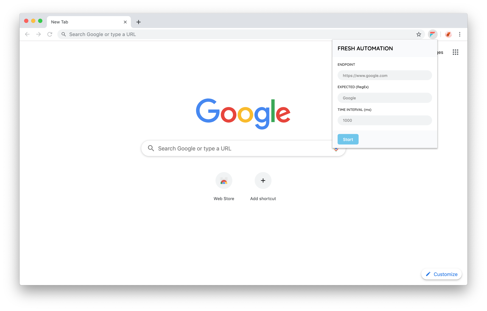

# Fresh

Fresh is a Chrome extension that will reload the webpage automatically until this page has the expected results. Install it from the [Chrome Webstore](https://chrome.google.com/webstore/detail/fresh/kbdbpnpehigcgobacppcfjnailecaabm).

## Usage
- Click the Fresh icon.
- Set endpoint, expected result, and timeout.
- Wait for the expected result after reloaded the webpage.

## Development
1. Run `git clone https://github.com/boomauakim/fresh.git`
2. Navigate to chrome://extensions
3. Make sure 'Developer mode' is checked
4. Click Load unpacked extension...
5. Browse to fresh/src and click Select
6. Let's code !

## Contribution
Any type of feedback, pull request or issue is welcome :)

## License
MIT